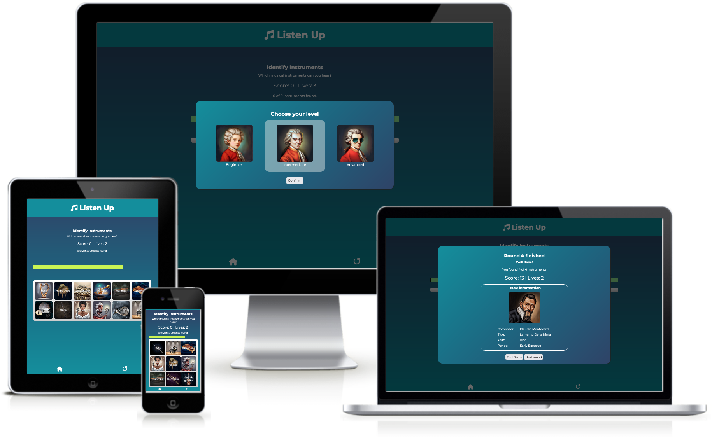
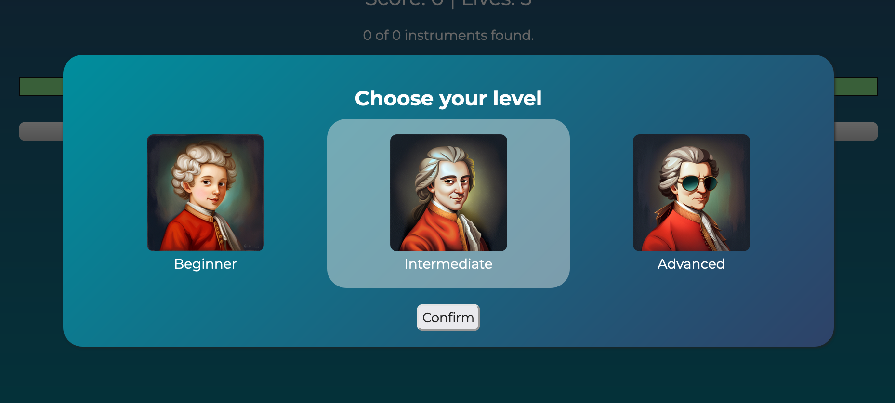
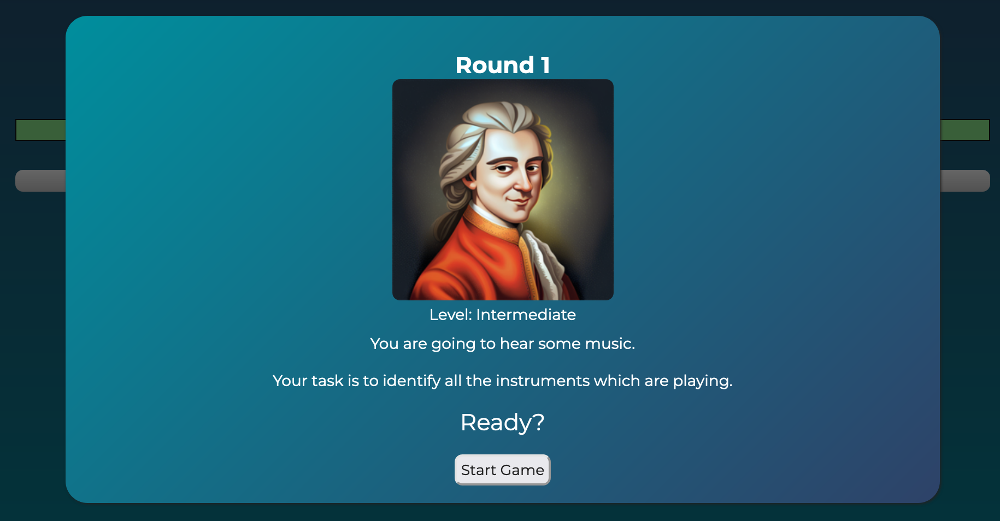
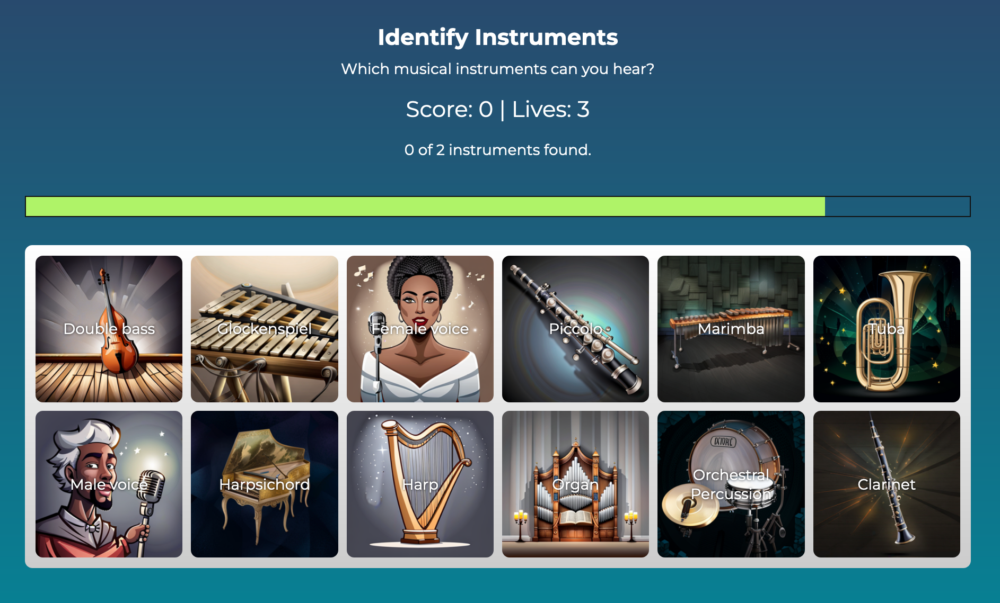
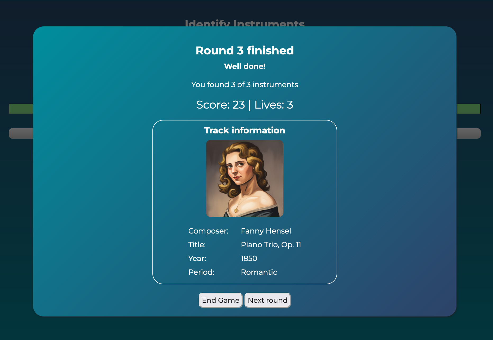
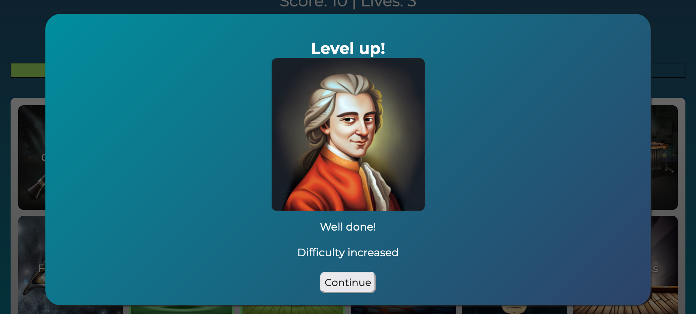
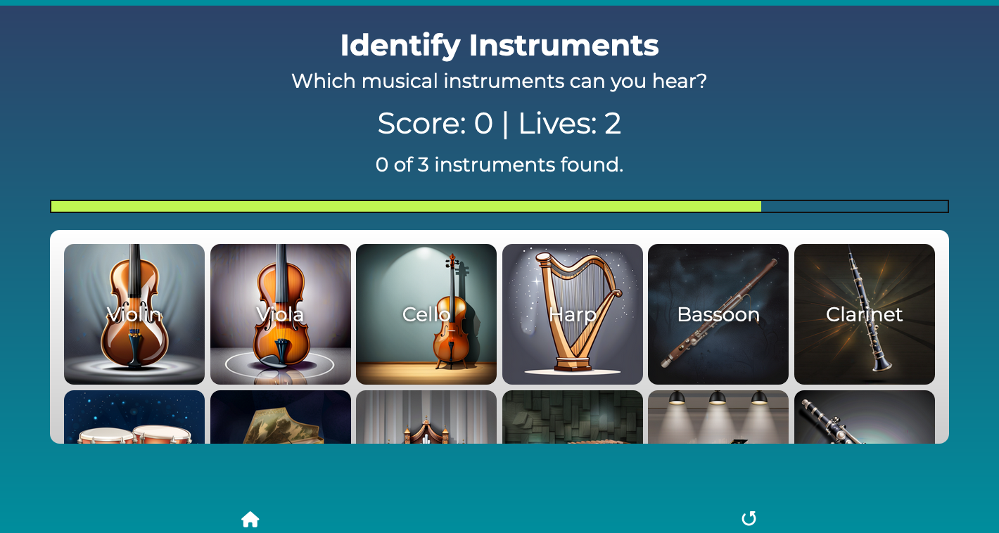
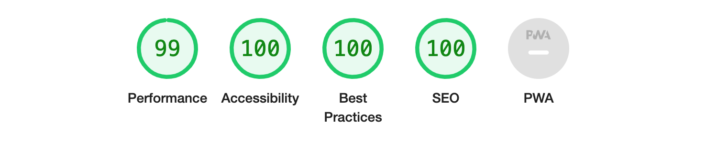

# Listen Up
## An educational music listening game

Listen Up is a fun educational game for music lovers of all ages. Listen to classical music from different eras and test your listening skills by identifying the instruments playing in each piece, while learning about the music at the same time.

Each round, you will hear a piece of music by a different composer from the Renaissance era to the 20th century. Find all the instruments playing in the piece before the time runs out! 

Whether you are a beginner or an experienced listener of classical music, you will enjoy playing Listen Up!

## Features 

### Existing Features

#### Level selection
After starting the game, the user is asked to choose a level according to their experience. This screen is designed with three stylized images of Mozart, one as a child, on as a young man and one wearing cool sunglasses, representing the three possible difficulty levels.

#### First round
The user is then presented with a quick explanatory screen, which lets them know what to do in the game.

#### Gameplay
Then the main game starts. A piece of music is played, and the user has to click on the musical instruments they can hear in the piece before the time runs out. The higher the difficulty, the less time the user has to identify all instruments. The user is presented with visual feedback letting them know whether they have clicked on a correct instrument or not.

#### End of round
After the user has found all instruments or the time has run out the user is presented with a screen which displays the rounds results and some information about the piece of music which is playing. The music will continue playing until the user starts the next round or until the piece is over.

#### Level up
After three rounds with no missed instruments, the difficulty is increased.

#### Game over
If a round ends before the user has found any of the instruments, they lose a live. When there are no lives left, the game ends.

#### Hiding header
On smaller screens, the header will automatically hide when the game starts in order to increase the space for the main content.

#### Footer section
The footer provides the user with the option to restart the game or to go back to the Home page.

### Future features

#### Must-have
- Add more music to the music library.

#### Nice-to-have
- A high score system for storing high scores in the browsers local storage.
- Different game modes, like a Quiz mode or a music explorer feature to explore the available music by composer, instrument or period).
- A tutorial showing first time users in more detail how the game works.
- A settings menu allowing the user to adjust the difficulty or the volume
- Display the remaining lives as icons instead of a number.

## Design

### Color Scheme
- A dark turquoise (`#008e9d`) and a dark blue (`#2e4268`) are used as the main colors of the application.

### Images
- The application uses cartoon-style images of musical instruments and composers to create a fun and casual atmosphere, setting a nice counterpoint to the often rather serious classical music environment.

### Wireframes
- The wireframe designs for the project can be found here: [Listen Up Wireframes](media/wireframes/listen-up-wireframes.pdf)

## Technologies Used

### Languages
- The application has been built with HTML, CSS and JavaScript.
- The music library and the list of musical instruments are stored in external JSON files.

### Libraries and Software 
#### [Font Awesome](https://fontawesome.com/)
- Font Awesome was used to add icons for aesthetic and UX purposes. The necessary files have been included in the assets/fontawesome folder to avoid loading them from an external resource each time the application is loaded.

#### [Google Fonts](https://fonts.google.com/)
- Google fonts was used to import the fonts 'Montserrat' and 'Delicious Handrawn'. The font files have been included in the assets/fonts folder, to ensure that they don't have to be loaded from an external resource.

#### [Git](https://git-scm.com/)
- Git was used for version control by committing changes to Git and pushing them to GitHub from the command line.

#### [GitHub](https://github.com/)
- GitHub is used to store the projects code after being pushed from Git and to deploy the website to GitHub pages at: https://nacht-falter.github.io/listen-up

#### [Balsamiq](https://balsamiq.com/)
- Balsamiq was used to create the [wireframes](#wireframes) during the design process.

#### [Pixelmator Pro](https://www.pixelmator.com/pro/)
- Pixelmator Pro was used to resize and edit images the application. 

#### [DreamStudio](https://beta.dreamstudio.ai)
- DreamStudio by Stability was used to generate the images used in the project.

## Testing

### W3C Validators
Both HTML and CSS pass the [W3C Markup Validator](https://validator.w3.org) and [W3C CSS Validator](https://jigsaw.w3.org/css-validator/) with no errors:
- [W3C Markup Validator results for index.html](https://validator.w3.org/nu/?doc=https%3A%2F%2Fnacht-falter.github.io%2Flisten-up%2Findex.html) 
- [W3C Markup Validator results for game.html](https://validator.w3.org/nu/?doc=https%3A%2F%2Fnacht-falter.github.io%2Flisten-up%2Fgame.html) 
- [W3C CSS Validator results](https://jigsaw.w3.org/css-validator/validator?uri=https%3A%2F%2Fnacht-falter.github.io%2Flisten-up%2Findex.html&profile=css3svg&usermedium=all&warning=1&vextwarning=&lang=en) 

### Jshint
All JavaScript code was validated through the [Jshint validator](https://jshint.com/). It passed with no errors and reported the following metrics:
   - There are 50 functions in this file.
   - Function with the largest signature take 3 arguments, while the median is 0.
   - Largest function has 27 statements in it, while the median is 2.5.
   - The most complex function has a cyclomatic complexity value of 7 while the median is 1.
   
### Chrome Lighthouse
A report on the application website generated with [Chrome Lighthouse](https://developer.chrome.com/docs/lighthouse/) showed no issues with the performance or accessibility of the application. 

[Detailed Chrome Lighthouse results](media/testing/listen-up-lighthouse-results.pdf)

### Further Testing
- The website was tested on a variety of devices (Desktop, Laptop, iPad, and iPhone). The following browsers and operating systems have been tested: 

	- macOS
		- Firefox
		- Google Chrome
		- Safari
	- Microsoft Windows
		- Firefox
		- Google Chrome
		- Microsoft Edge 
	- iOS
		- Safari
		- Firefox
	- iPadOS
		- Safari
		- Firefox
  
- The website is working as expected in all tested browsers, with one exception: On iOS it is not possible to control the audio volume with JavaScript, that is why the functions controlling the audio playback initially did not work. This issue has been resolved by checking the user's operating system before trying to control the volume.
- All links, buttons and forms were thoroughly tested to make sure they work as expected.
- Friends and family members were asked to review the application and documentation to point out any bugs or user experience issues.

### Known limitations
- So far, there is only a relatively small number of entries in the music library, which may cause the game to become repetitive rather quickly. The music library will have to be expanded in the future to keep the game interesting and exiting.

## Deployment

### GitHub Pages
The site was deployed using GitHub pages. The steps used to deploy the site are as follows:

- Go to the GitHub repository at https://github.com/nacht-falter/listen-up
- In the GitHub repository, navigate to the Settings tab
- From the source section drop-down menu, select the Main Branch
- Once the Main branch has been selected, the page will be automatically refreshed with a detailed ribbon display to indicate the successful deployment.

The link to the live website can be found here: [https://nacht-falter.github.io/listen-up](https://nacht-falter.github.io/listen-up/index.html)

## Credits

The following resources were used in the project:

### Code

#### JavaScript
- Finding all matching elements within an array of objects: https://stackoverflow.com/questions/52311150/
- Comparing two arrays of objects: https://bobbyhadz.com/blog/javascript-get-difference-between-two-arrays-of-objects
- Getting the set difference of two arrays: https://stackoverflow.com/questions/45342155/how-to-subtract-one-array-from-another-element-wise-in-javascript
- Get random items from array: https://stackoverflow.com/questions/19269545/how-to-get-a-number-of-random-elements-from-an-array
* Shuffle array: https://stackoverflow.com/questions/6274339/how-can-i-shuffle-an-array
- Play audio file: https://stackoverflow.com/questions/52575143/play-an-audio-file-in-javascript
- Log an error if the source of an audio file is not available: https://www.w3schools.com/tags/av_event_error.asp
- Fade out audio: https://thewebdev.info/2021/10/14/how-to-playback-html-audio-with-fade-in-and-fade-out-with-javascript/
- Get a number within a range: https://stackoverflow.com/questions/5842747/how-can-i-use-javascript-to-limit-a-number-between-a-min-max-value
- JavaScript redirect: https://www.w3schools.com/howto/howto_js_redirect_webpage.asp
- Fetch data from JSON files: https://www.w3schools.com/jsref/tryit.asp?filename=tryjsref_api_fetch
- Ask for confirmation before leaving or refreshing the page: https://stackoverflow.com/questions/3221161/how-to-pop-up-an-alert-box-when-the-browsers-refresh-button-is-clicked
  
#### CSS
- Centering an element in the center of the viewport: https://www.w3schools.com/css/css_align.asp
- Grid layout with square grid items: https://stackoverflow.com/questions/54927180/css-grid-square-layout
- Shake animation: https://css-tricks.com/snippets/css/shake-css-keyframe-animation

### Fonts
- Montserrat (main font): https://fonts.google.com/specimen/Montserrat 
- Delicious Handrawn (only used for score numbers): https://fonts.google.com/specimen/Delicious+Handrawn 
- Font Awesome (for icons): [https://fontawesome.com/](https://fontawesome.com/)

### Media
#### Music:
All music used in this project is in the public domain and was downloaded from https://musopen.org or https://commons.wikimedia.org. As of now, the following pieces are included in the music library:
- [Alban Berg - 4 Pieces, Op. 5](https://musopen.org/music/9783-4-stucke-op5/)
- [Antonio Vivaldi - Concerto for Bassoon in a minor, RV 498](https://musopen.org/music/45471-concerto-for-bassoon-in-a-minor-rv-498/)
- [Arnold Schönberg - String Quartet No. 2, 4th movement](https://commons.wikimedia.org/wiki/File:Schoenberg_Quartet_No._2_4th_movement.OGG)
- [Camille Saint-Saëns - Bassoon Sonata, Op. 168](https://musopen.org/music/8935-bassoon-sonata-op-168/)
- [Clara Schumann - Scherzo no. 2, Op. 14](https://musopen.org/music/20639-scherzo-no-2-op-14/)
- [Claude Debussy - Cello Sonata](https://musopen.org/music/4516-cello-sonata/)
- [Claude Debussy - Fêtes galante, Fantoches](https://musopen.org/music/29415-fetes-galantes/)
- [Claudio Monteverdi - Lamento della ninfa, SV 163](https://musopen.org/music/14915-lamento-della-ninfa-sv-163/)
- [Claudio Monteverdi L'Orfeo, SV 318, Signor, quell'infelice](https://musopen.org/music/4319-lorfeo-sv-318/)
- [Fanny Hensel - Piano Trio, Op. 11](https://musopen.org/music/43115-piano-trio-op-11/)
- [Johann Sebastian Bach - Violin Partita, No. 1 (BWV 1002) - I. Allemanda](https://musopen.org/music/13574-violin-partita-no-1-bwv-1002/)
- [Johannes Brahms - Clarinet Sonata No. 1, Op. 120](https://musopen.org/music/6747-clarinet-sonata-no-1-op-120-no-1/)

#### Images:
All images used in this project were generated by StabilityAI with [DreamStudio](https://beta.dreamstudio.ai). (Turns out AI is not yet very good at generating images of musical instruments. Some of them look quite weird on closer inspection. 😅)

### Acknowledgements
- I would like to thank my Code Institute mentor for his continuous support and helpful advice.
- I would like to thank all friends and family members who have tested the application for their helpful feedback and suggestions.